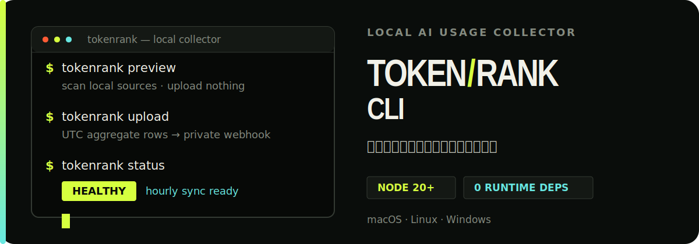

<p align="right">
  <strong>English</strong> · <a href="./README.zh-CN.md">Chinese</a>
</p>

<p align="center">
  
</p>

<p align="center">
  <a href="https://tokenrank.org"><strong>TokenRank leaderboard</strong></a> ·
  <a href="https://tokenrank.org/onboard">Generate a private webhook</a> ·
  <a href="./docs/api-contract.md">Upload API contract</a> ·
  <a href="./CHANGELOG.md">Changelog</a>
</p>

TokenRank CLI is the standalone local collector for [TokenRank](https://tokenrank.org). It reads exact token records from supported AI tools, aggregates them on the device by UTC date, tool, and model, then sends aggregate rows to the user's private webhook.

**Preview first. Connect only when you are ready:**

```bash
npx --yes tokenrank preview
```

This command requires no account, uploads nothing, and does not change background services.

## Install

The CLI requires Node.js 20 or newer and has zero runtime dependencies.

### Stable installers

macOS / Linux:

```bash
curl -fsSL "https://tokenrank.org/install.sh" | bash
```

Windows PowerShell:

```powershell
irm "https://tokenrank.org/install.ps1" | iex
```

The website installers inject the current user's private webhook and hand off to this repository's latest release. You can also install directly from [GitHub Releases](https://github.com/tokenrank/tokenrank-cli/releases/latest).

## Quick start

After generating a private webhook in [TokenRank Onboarding](https://tokenrank.org/onboard):

```bash
tokenrank connect "https://tokenrank.org/api/collector/upload/<token>"
tokenrank preview
tokenrank upload
tokenrank service install
tokenrank status
```

Installers follow `connect → initial upload → service install`. A background service is registered only after the first upload succeeds.

## Command map

| Command | Purpose | Uploads data |
| --- | --- | --- |
| `tokenrank preview [--json]` | Scan and show the aggregate payload before upload | No |
| `tokenrank tools` | List supported AI tools | No |
| `tokenrank sources` | Show source adapter status | No |
| `tokenrank doctor` | Diagnose exact data sources and usable records | No |
| `tokenrank connect <url>` | Save a private webhook on the device | No |
| `tokenrank upload` | Upload the current full or incremental aggregate | Yes |
| `tokenrank status [--json]` | Check connection, sync, and aggregate state | No |
| `tokenrank service install` | Register hourly staggered sync | Initial upload already completed |
| `tokenrank service status` | Inspect the system background job | No |
| `tokenrank service uninstall` | Remove the background job | No |
| `tokenrank logout` | Remove the local connection | No |

All commands support `--lang en`, `--lang zh`, and `--lang auto`. You can also set `TOKENRANK_LANG=en|zh`.

## Privacy boundary

| Uploaded | Never uploaded |
| --- | --- |
| UTC date, AI tool, and model | Prompts and chat content |
| Input, output, cache read, cache write, and total tokens | Source code, filenames, and file contents |
| Anonymous device ID, CLI version, timezone, and generation time | Raw logs and provider credentials |

- `preview --json` exposes the complete payload before upload.
- `doctor` does not print local source paths or raw log content.
- Local state contains dates, tools, models, and token aggregates—not conversation content.
- When an exact token field is unavailable, the CLI does not substitute request counts, credits, character counts, or estimates.

## Supported tools

The CLI currently ships 18 source adapters:

```text
codex             claude-code       hermes
openclaw          cline             opencode
workbuddy         gemini            zcode
kimi              kilo-code         codex-vps
roo-code          qwen              codex-cache
cursor            github-copilot    continue
```

Attribution follows the AI tool that actually made the model call, not the host editor. For example, Codex running inside Cursor still counts as `codex`. Calls from a main agent and locally observable subagents roll into the same tool total; no subagent-level detail is uploaded.

The collector deduplicates events by provider event ID and source priority. Cursor, GitHub Copilot, and Continue contribute only when their source includes explicit token fields.

## Automatic sync and recovery

macOS uses a LaunchAgent, Linux uses a persistent systemd user timer, and Windows uses a hidden, non-interactive Task Scheduler job.

- Each device derives one stable staggered minute from its anonymous `deviceId`.
- Missed schedules catch up on the next startup or login.
- Local locks and schedule-boundary state prevent concurrent snapshots and duplicate runs.
- Non-TTY and background runs hide interactive progress by default.
- Direct, HTTP proxy, and HTTPS CONNECT attempts all have absolute deadlines.

<details>
<summary><strong>v2 cutover / high-water correctness model</strong></summary>

All events are assigned to UTC calendar days. The first v2 sync starts from the server-confirmed UTC cutover date and uses a replayable atomic full snapshot. Later hourly syncs send only new or increased high-water aggregate rows; when nothing changes, the CLI makes no request.

Full snapshots and incremental uploads persist pending/WAL state before sending and clear it only after every batch is acknowledged. Log rotation, temporary failures, or a reduced scan cannot lower confirmed history. If local aggregate state is missing or corrupt, the CLI rescans from the server-authoritative cutover. Switching to a different account clears the previous account's aggregate state to prevent cross-account reuse.

Any stateful scan that hits a file-limit truncation, read error, or oversized-record skip fails closed: it neither uploads nor advances the ACK. See [docs/api-contract.md](docs/api-contract.md) for the protocol.

</details>

## Terminal behavior

Interactive color output uses signal lime `#D6FF3F`, warning orange `#FF5B35`, ivory `#F2F1E8`, and muted green `#858B80`. Compact cards, tables, and single-line status messages keep real scan and upload progress in focus.

- Progress is written only to stderr, so `preview --json`, pipes, and redirected stdout remain clean.
- `NO_COLOR=1` disables color.
- `TOKENRANK_NO_ANIMATION=1` keeps static status feedback but disables animation.
- `TOKENRANK_NO_PROGRESS=1` disables interactive progress entirely.
- Wide terminals use at most 78 columns; narrow terminals switch to a compact layout and require no Nerd Font.

## Local development

```bash
pnpm install
pnpm check
pnpm lint
pnpm typecheck
pnpm test
pnpm tokenrank tools
```

Tests cover date normalization, source parsing, subagent aggregation, event deduplication, v2 cutover/high-water behavior, atomic multi-batch snapshots, retry and 4xx boundaries, proxies, schedule recovery, and background jobs on macOS, Linux, and Windows.

## Project boundary

| TokenRank CLI | TokenRank Web |
| --- | --- |
| Local scanning and streaming aggregation | X identity and webhook lifecycle |
| CLI output, installers, and background scheduling | Server-side payload validation and persistence |
| Client payload, version, and release | Leaderboards, public profiles, and dashboard |

The shared boundary is `GET/POST /api/collector/upload/:token`. This repository must not import TokenRank Web source code and does not depend on Next.js, a database, or authentication modules.

## Release

1. Update the version in `package.json` and add an entry to `CHANGELOG.md`.
2. Run `pnpm check`, `pnpm lint`, `pnpm typecheck`, and `pnpm test`.
3. Push a `vX.Y.Z` tag.
4. GitHub Actions creates a release with the CLI, package metadata, and both platform installers.

## Contributing and license

Please use [GitHub Issues](https://github.com/tokenrank/tokenrank-cli/issues) for bugs and source-adapter proposals. TokenRank CLI is released under the [MIT License](LICENSE).
